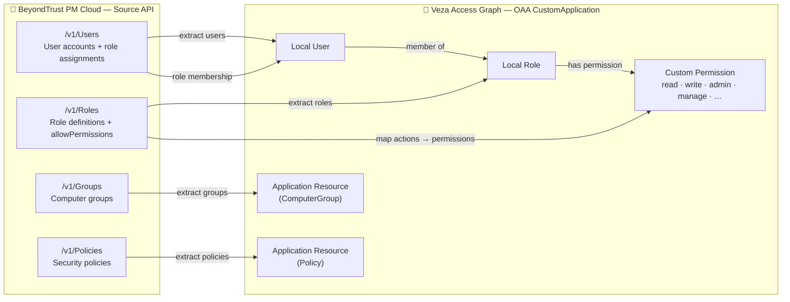

# BeyondTrust EPM → Veza OAA Integration

## 1. Overview

This integration collects **identity and permission data** from BeyondTrust Privilege Management Cloud (PM Cloud) and pushes it to Veza's Access Graph via the Open Authorization API (OAA).

### What it ingests

| BeyondTrust PM Cloud | Veza OAA Entity | Notes |
|---|---|---|
| PM Cloud tenant | `CustomApplication` | One app per tenant |
| User | `Local User` | accountName, email, disabled state, last sign-in |
| Role | `Local Role` | Name, allowPermissions |
| Policy | `Application Resource` (type: `Policy`) | Security policies |
| Computer Group | `Application Resource` (type: `ComputerGroup`) | Endpoint groups |
| Role → allowPermissions | `Custom Permission` | Derived from role permission action strings |
| User → Role assignment | `Local User` member of `Local Role` | Inline on user record |

### Data flow

```
BeyondTrust PM Cloud API
  → OAuth2 token (client credentials)
  → GET /v1/Users      (paginated)
  → GET /v1/Roles      (full list)
  → GET /v1/Groups     (paginated)
  → GET /v1/Policies   (paginated)
  → build OAA CustomApplication payload
  → push_application() → Veza Access Graph
```

### OAA Permission mapping

| BeyondTrust action (substring) | Veza OAA Permissions |
|---|---|
| `read`, `view`, `list` | DataRead, MetadataRead |
| `write`, `update`, `modify` | DataRead, DataWrite, MetadataRead |
| `create` | DataWrite, MetadataWrite |
| `delete` | DataWrite, MetadataWrite |
| `manage` | DataRead, DataWrite, MetadataRead, MetadataWrite |
| `admin`, `full` | DataRead, DataWrite, MetadataRead, MetadataWrite, NonPrivilegedAccess |
| *(unrecognised)* | DataRead, MetadataRead |

---

## 2. Entity Relationship Map



---

## 3. How It Works

1. **Authenticate** — Obtain an OAuth2 bearer token from `/oauth/connect/token` using client credentials.
2. **Fetch Roles** — Retrieve all roles and their `allowPermissions` (resource + action pairs).
3. **Fetch Users** — Paginate through all users; each user record includes its assigned roles inline.
4. **Fetch Groups** — Paginate through all computer groups.
5. **Fetch Policies** — Paginate through all security policies.
6. **Build payload** — Construct a `CustomApplication` with Local Users, Local Roles, Application Resources (Policies + Groups), and Custom Permissions.
7. **Push** — Call `veza_con.push_application()` to upsert into Veza's Access Graph.

---

## 4. Prerequisites

| Requirement | Details |
|---|---|
| Python | 3.9 or higher |
| Network | HTTPS access to `*.pm.beyondtrustcloud.com` and `*.veza.com` |
| BeyondTrust API client | Created in PM Cloud: **Settings → API Registration** |
| OAuth2 scope | `urn:management:api` |
| Veza API key | Generated in Veza with OAA write access |

### Creating a BeyondTrust API client

1. Log in to BeyondTrust PM Cloud as an Administrator.
2. Navigate to **Settings → API Registration**.
3. Click **Add API Client**.
4. Grant the **read** permissions for Users, Roles, Groups, and Policies.
5. Copy the **Client ID** and **Client Secret** — the secret is shown only once.

---

## 5. Quick Start

```bash
curl -fsSL https://raw.githubusercontent.com/<org>/<repo>/main/integrations/beyondtrust-epm/install_beyondtrust_epm.sh | bash
```

---

## 6. Manual Installation

### RHEL / CentOS / Amazon Linux

```bash
# Install system packages
sudo dnf install -y python3 python3-pip git curl

# Create install directory and service account
sudo useradd -r -s /bin/bash -m -d /opt/beyondtrust-epm-veza beyondtrust-epm-veza
sudo mkdir -p /opt/VEZA/beyondtrust-epm-veza/scripts /opt/VEZA/beyondtrust-epm-veza/logs
sudo chown -R beyondtrust-epm-veza: /opt/VEZA/beyondtrust-epm-veza

# Clone and copy integration
git clone https://github.com/<org>/<repo>.git /tmp/veza-repo
sudo cp /tmp/veza-repo/integrations/beyondtrust-epm/beyondtrust_epm.py \
        /opt/VEZA/beyondtrust-epm-veza/scripts/
sudo cp /tmp/veza-repo/integrations/beyondtrust-epm/requirements.txt \
        /opt/VEZA/beyondtrust-epm-veza/scripts/

# Create virtual environment
cd /opt/VEZA/beyondtrust-epm-veza/scripts
python3 -m venv venv
./venv/bin/pip install -r requirements.txt

# Configure
sudo cp .env.example .env
sudo nano .env          # fill in credentials
sudo chmod 600 .env
```

### Ubuntu / Debian

```bash
sudo apt-get update && sudo apt-get install -y python3 python3-pip python3-venv git curl
# Then follow the same steps as above (replacing dnf with apt-get)
```

### Configure `.env`

```bash
cp .env.example .env
chmod 600 .env
```

Edit `.env`:
```ini
BT_URL=https://your-tenant.pm.beyondtrustcloud.com
BT_CLIENT_ID=your_client_id
BT_CLIENT_SECRET=your_client_secret
VEZA_URL=https://your-company.veza.com
VEZA_API_KEY=your_veza_api_key
```

---

## 7. Usage

```bash
cd /opt/VEZA/beyondtrust-epm-veza/scripts
source venv/bin/activate
python3 beyondtrust_epm.py [OPTIONS]
```

| Argument | Required | Default | Description |
|---|---|---|---|
| `--bt-url` | Yes* | `BT_URL` env | BeyondTrust PM Cloud base URL |
| `--bt-client-id` | Yes* | `BT_CLIENT_ID` env | OAuth2 client ID |
| `--bt-client-secret` | Yes* | `BT_CLIENT_SECRET` env | OAuth2 client secret |
| `--veza-url` | Yes* | `VEZA_URL` env | Veza tenant URL |
| `--veza-api-key` | Yes* | `VEZA_API_KEY` env | Veza API key |
| `--env-file` | No | `.env` | Path to .env credentials file |
| `--provider-name` | No | `BeyondTrust EPM` | Provider label in Veza |
| `--datasource-name` | No | `BeyondTrust PM Cloud` | Datasource label in Veza |
| `--dry-run` | No | false | Build payload, skip Veza push |
| `--save-json` | No | false | Save OAA JSON payload to disk |
| `--log-level` | No | `INFO` | `DEBUG`, `INFO`, `WARNING`, `ERROR` |
| `--page-size` | No | `200` | Records per API page (max 200) |

*\*Required unless set in `.env` or environment variables.*

### Examples

```bash
# Dry-run with verbose logging
python3 beyondtrust_epm.py --dry-run --save-json --log-level DEBUG

# Full push with custom names
python3 beyondtrust_epm.py \
  --provider-name "BeyondTrust EPM" \
  --datasource-name "WestRock PM Cloud Production"

# Non-interactive (CI/CD)
BT_URL=https://... BT_CLIENT_ID=... BT_CLIENT_SECRET=... \
VEZA_URL=https://... VEZA_API_KEY=... \
python3 beyondtrust_epm.py --dry-run
```

---

## 8. Deployment on Linux

### Service account & permissions

```bash
# Create dedicated service account
sudo useradd -r -s /bin/bash -m -d /opt/beyondtrust-epm-veza beyondtrust-epm-veza

# Set ownership
sudo chown -R beyondtrust-epm-veza: /opt/VEZA/beyondtrust-epm-veza

# Protect credentials
sudo chmod 600 /opt/VEZA/beyondtrust-epm-veza/scripts/.env
sudo chmod 700 /opt/VEZA/beyondtrust-epm-veza/scripts
```

### SELinux (RHEL)

```bash
# Check SELinux status
getenforce

# Restore file contexts if needed
sudo restorecon -Rv /opt/VEZA/beyondtrust-epm-veza/
```

### Cron scheduling

Create `/opt/VEZA/beyondtrust-epm-veza/run.sh`:

```bash
#!/bin/bash
cd /opt/VEZA/beyondtrust-epm-veza/scripts
./venv/bin/python3 beyondtrust_epm.py --env-file .env >> \
  /opt/VEZA/beyondtrust-epm-veza/logs/cron.log 2>&1
```

```bash
chmod +x /opt/VEZA/beyondtrust-epm-veza/run.sh
```

Create `/etc/cron.d/beyondtrust-epm-veza`:

```cron
# BeyondTrust EPM → Veza OAA — runs daily at 2:00 AM UTC
0 2 * * * beyondtrust-epm-veza /opt/VEZA/beyondtrust-epm-veza/run.sh
```

### Log rotation (`/etc/logrotate.d/beyondtrust-epm-veza`)

```
/opt/VEZA/beyondtrust-epm-veza/logs/*.log {
    daily
    missingok
    rotate 30
    compress
    notifempty
    create 0640 beyondtrust-epm-veza beyondtrust-epm-veza
}
```

---

## 9. Multiple Instances

If you manage multiple BeyondTrust PM Cloud tenants, create a separate `.env` file per tenant and pass it with `--env-file`:

```bash
# Tenant A
python3 beyondtrust_epm.py --env-file .env.tenant-a --datasource-name "PM Cloud - Tenant A"

# Tenant B
python3 beyondtrust_epm.py --env-file .env.tenant-b --datasource-name "PM Cloud - Tenant B"
```

Stagger cron jobs by 15–30 minutes to avoid rate limiting.

---

## 10. Security Considerations

- Store `.env` with `chmod 600` and owned by the service account only.
- Rotate BeyondTrust client secrets and Veza API keys on your organisation's credential rotation schedule.
- The BeyondTrust API client should be scoped to **read-only** permissions (Users, Roles, Groups, Policies read).
- Never commit `.env` to version control; only commit `.env.example` with placeholder values.
- Review SELinux/AppArmor policies before deploying on hardened systems.

---

## 11. Troubleshooting

| Symptom | Likely cause | Fix |
|---|---|---|
| `OAuth2 token request failed: HTTP 400` | Invalid client credentials | Verify `BT_CLIENT_ID` and `BT_CLIENT_SECRET` |
| `OAuth2 token request failed: HTTP 401` | Wrong scope or client disabled | Check scope is `urn:management:api`; confirm client is enabled |
| `HTTP 401 Unauthorized` on API calls | Token expired mid-run | Script re-authenticates per run; check clock skew |
| `Veza push failed: HTTP 401` | Invalid or expired Veza API key | Regenerate key in Veza |
| `ModuleNotFoundError: No module named 'oaaclient'` | Dependencies not installed in venv | Run `./venv/bin/pip install -r requirements.txt` |
| Empty user / role counts | API client lacks read permissions | Re-check API client scopes in PM Cloud Settings |
| Users missing role assignments | Role ID mismatch | Enable `--log-level DEBUG` and inspect role ID lookups |
| Paginated data truncated | `--page-size` too low | Increase `--page-size` up to 200 |

---

## 12. Changelog

| Version | Date | Notes |
|---|---|---|
| 1.0 | 2026-05-06 | Initial release — Users, Roles, Policies, Groups via PM Cloud Management API v1 |
